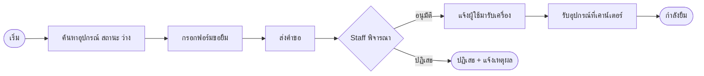
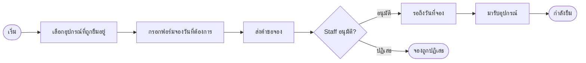
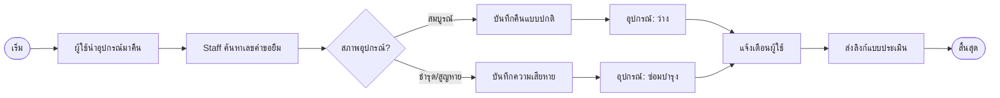
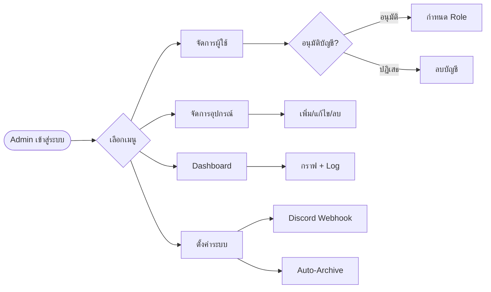
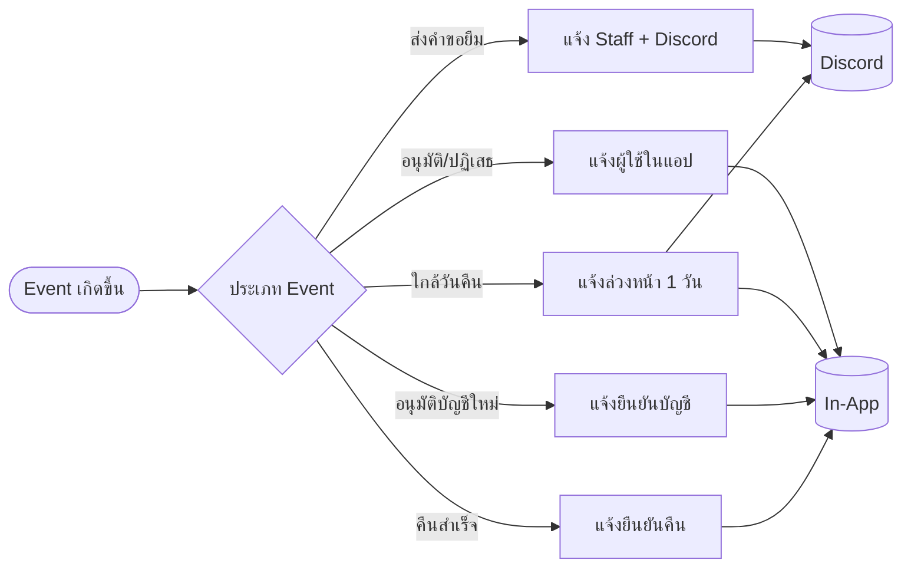
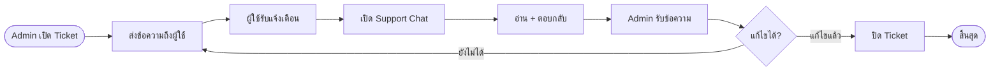

# Flowcharts - Notebook System V5
> โค้ด Mermaid สำหรับแผนผังทุกระบบ
> สามารถ render ได้ที่ https://mermaid.live หรือ VS Code Extension: Mermaid Preview

---

## ภาพที่ 3.1 — กระบวนการยืมอุปกรณ์ (Lending Process)

---

## ภาพที่ 3.1b — กระบวนการจองล่วงหน้า (Reservation Process)

---

## ภาพที่ 3.2 — กระบวนการส่งคืนอุปกรณ์ (Return Process)

---

## ภาพที่ 3.3 — กระบวนการบริหารจัดการสำหรับ Admin (Management Process)

---

## ภาพที่ 3.4 — ระบบแจ้งเตือนอัตโนมัติ (Notification System)

---

## ภาพที่ 3.5 — ระบบ Support Chat (ช่องทางสื่อสาร)

